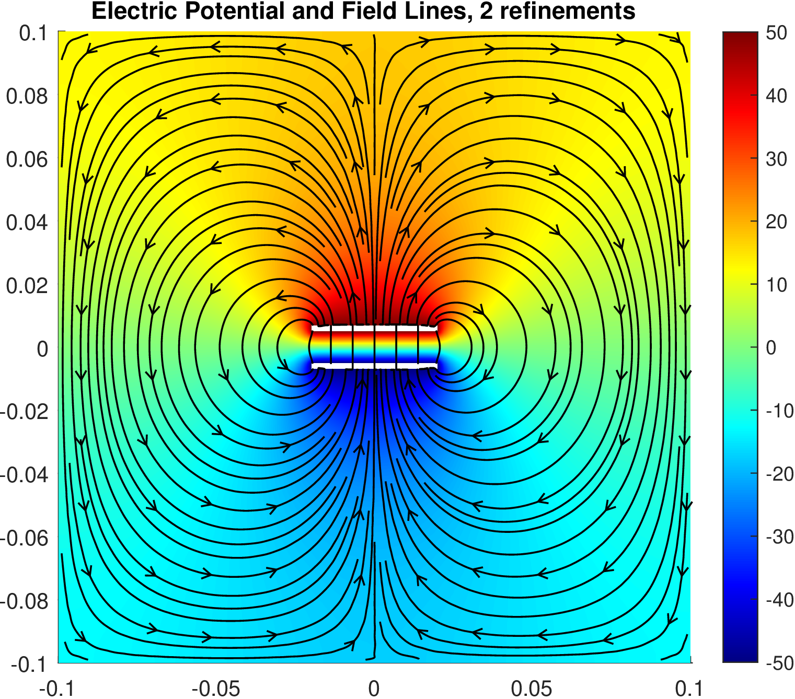
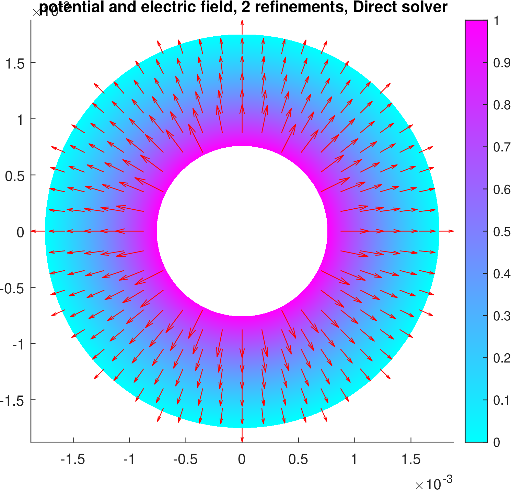

# The FEM Method for Homogenous Poisson and Eigenvalue Problems

### Method Formulation for electrostatic potential problems

We are solving 2D problems, so we divide the computational region into 2D simplexes, i.e., triangles.  
Defining the simplex coordinates of a point $(x,y)$ in a triangle as $\zeta_i(x,y) = h_i / H_i$  
with $h_i$ the distance of the point from the side that does not contain node $i$  
and $H_i$ the height of the triangle from node $i$, then:

$$
\zeta_i(x,y) = a_i + b_ix + c_iy, \quad i = 1,2,3
$$

where $a_i, b_i, c_i$ are given with circular alternation from:

$$
a_1 = \frac{x_2 y_3 - x_3 y_2}{D}, \quad
b_1 = \frac{y_2 - y_3}{D}, \quad
c_1 = \frac{x_3 - x_2}{D}
$$

$$
D =  
\left| 
\begin{array}{ccc}
1 & x_1 & y_1 \\
1 & x_2 & y_2 \\
1 & x_3 & y_3 \\
\end{array} 
\right|
$$

Write, inside the triangle, the potential as:

$$
\phi \approx \sum_{i=1}^3 \phi_i N_i^t
$$

where $\phi_i$ is the potential in node $i$ and we choose $N_i^t = \zeta_i$ the local (inside triangle $t$) basis functions.  
We try to find the values $\phi_i$ for every node.  
Define the global basis functions as:

$$
N_p = \sum_{t \mid p \in t} N_i^t
$$

where $t$ triangle such as the node $p$ is on it, and $i$ the local numbering of $p$ on $t$.  
The potential is:

$$
\phi \approx \sum_{p=1}^{N_n} \phi_p N_p
\tag{1}
$$

where $N_n$ is the number of nodes.

---

We solve the Poisson equation:

$$
\nabla \cdot (\epsilon \nabla \phi) + \rho = 0
$$

using the **Galerkin method**, which is a type of weighted residual methods:

$$
\langle \phi', \nabla \cdot (\epsilon \nabla \phi) + \rho \rangle = 0
$$

where we choose as test functions $\phi'$ the basis functions $N_i$, so:

$$
\iint_{\Omega} \phi' [ \nabla \cdot (\epsilon \nabla \phi) + \rho ] ds = 0, \quad \forall \phi' \in \{N_i\}
$$

where $\Omega$ is the computational domain.  
These equations are as many as the unknown nodes.

They are equivalently written as:

$$
-\iint_{\Omega} \nabla \phi' \cdot \epsilon \nabla \phi \, ds + \oint_{c} \phi' \epsilon \frac{\partial \phi}{\partial \hat{n}} \, dl + \iint_{\Omega} \phi' \rho \, ds = 0
\tag{2}
$$

If we have **homogeneous Neumann conditions** ($\frac{\partial \phi}{\partial \hat{n}} = 0$), the second term of (2) becomes zero.  
Also, for **Dirichlet boundary conditions** (known $\phi$), the test functions $\phi' \in \{N_i\}$ are 0 on the boundary.  
So again, the second term vanishes. In both problems we assume
no charge ($\rho = 0$)

Hence:

$$
\iint_{\Omega} \nabla \phi' \cdot \epsilon \nabla \phi \, ds = 0
$$

Discretizing by replacing from (1), and taking $\phi' = N_q$ for some $q$:

$$
\iint_{\Omega} \nabla N_q(\mathbf{r}) \cdot \epsilon \nabla \left( \sum_p \phi_p N_p(\mathbf{r}) \right) ds = 0
$$

$$
\Rightarrow \sum_p \phi_p \iint_{\Omega} \nabla N_q(\mathbf{r}) \cdot \epsilon \nabla N_p(\mathbf{r}) \, ds = 0
\tag{3}
$$

We have:

$$
N_i^t (x,y) = \zeta_i(x,y) = a_i + b_i x + c_i y \text{ (in the triangle, 0 elsewhere)}
$$

$$
\nabla N_i^t =
\begin{bmatrix}
b_i \\
c_i
\end{bmatrix}, \quad \text{(in the triangle, 0 elsewhere)}
$$

For each node, the global basis function within each triangle it belongs to is the same as its local one; elsewhere it’s zero.  
So, the product $\nabla N_p \cdot \epsilon \nabla N_q$ is zero for non-neighboring nodes.  
For neighboring nodes $p, q$ in the same triangle $t$:

$$
\nabla N_p \cdot \epsilon \nabla N_q =
\nabla N_i^t \cdot \epsilon \nabla N_j^t =
\begin{bmatrix}
b_i \\
c_i
\end{bmatrix}
\cdot \epsilon
\begin{bmatrix}
b_j \\
c_j
\end{bmatrix}
= \epsilon (b_i b_j + c_i c_j)
$$

with $i, j$ the local indices in $t$. Assuming constant $\epsilon$ in each triangle:

$$
\iint_S \nabla N_p \cdot \epsilon \nabla N_q \, dS = \sum_{t \mid p,q \in t} \epsilon (b_i b_j + c_i c_j) A_e
\tag{4}
$$

where $A_e = D/2$ is the area of triangle $t$, and $b, c$ come from earlier formulas.  
So (3) becomes:

$$
\sum_p \phi_p \sum_{t \mid p,q \in t} \epsilon (b_i b_j + c_i c_j) A_e = 0, \quad \forall q \in \{1,..,N_n\}
\tag{5}
$$

Define matrix $\mathbf{S}$ of size $N_n \times N_n$:

$$
\mathbf{S}[p,q] = \sum_{t \mid p,q \in t} \epsilon (b_i b_j + c_i c_j) A_e
$$

and column vector $\mathbf{F}$ containing nodal potentials $\phi_p$, then:

$$
\mathbf{S} \cdot \mathbf{F} = 0
$$

---

We compute $\mathbf{S}$ by looping over triangles, and for each of the 9 combinations $(p,q)$ (global), $(i,j)$ (local),  
we add:

$$
\epsilon (b_i b_j + c_i c_j) A_e
$$

to entry $[p,q]$ of $\mathbf{S}$.

---

Now consider nodes with **Dirichlet** boundary conditions.  
We rearrange $\mathbf{F}$ so that unknown (free) potentials are first:

$$
\mathbf{F} = 
\begin{bmatrix}
\mathbf{F}_f \\\ \mathbf{F}_p
\end{bmatrix}
$$

$$
\mathbf{S} =
\begin{bmatrix}
\mathbf{S}_{ff} & \mathbf{S}_{fp} \\
\mathbf{S}_{pf} & \mathbf{S}_{pp}
\end{bmatrix}
$$

Then the system is:

$$
\mathbf{S}_{ff} \cdot \mathbf{F}_f = - \mathbf{S}_{fp} \cdot \mathbf{F}_p \tag{6}
$$

Solving (6) gives the unknown nodal potentials.

---

### Energy Algorithm

Once we’ve found the potential, the total energy per unit length is:

$$
W_e = \frac{1}{2} \iint_S \epsilon |\mathbf{E}|^2 \, dS = \frac{1}{2} \iint_S \nabla \phi \cdot \epsilon \nabla \phi \, dS
\tag{7}
$$

Using the basis expansion from (1):

$$
W_e \approx \frac{1}{2} \iint_S \nabla \left( \sum_p \phi_p N_p(\mathbf{r}) \right) \cdot \epsilon \nabla \left( \sum_q \phi_q N_q(\mathbf{r}) \right) dS
$$

Since $\phi_p$ are known and the sums are finite:

$$
W_e \approx \frac{1}{2} \sum_p \sum_q \phi_p \phi_q \iint_S \nabla N_p(\mathbf{r}) \cdot \epsilon \nabla N_q(\mathbf{r}) \, dS
$$

Substituting from (4):

$$
W_e \approx \frac{1}{2} \sum_p \sum_q \phi_p \phi_q \sum_{t \mid p,q \in t} \epsilon (b_i b_j + c_i c_j) A_e
$$

Again, loop through triangles and for each of the 9 combinations of their nodes add:

$$
\frac{1}{2} \epsilon \phi_i \phi_j (b_i b_j + c_i c_j) A_e
$$

incrementally to compute $W_e$ efficiently.

--- 

In the files coaxial.m, capacitor.m is the MATLAB implementation of the above.

Some results:

  
  

